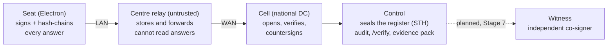

# Saakshi (साक्षी, "witness")

[](https://github.com/anirudh12032008/saakshi/actions/workflows/windows.yml)
[](https://github.com/anirudh12032008/saakshi/actions/workflows/server.yml)
[](LICENSE)

Hackathon Challenge 6 submission: a resilient, provable CBT exam ecosystem. It signs and hash-chains every answer at the seat, keeps working through relay/cell/link failures, makes any tampering after the fact locatable and recoverable, and runs synthetic-data analytics that flag likely cheating and decide who gets compensated, re-tested or re-conducted — without ever auto-penalising a candidate. Stages 0–6 are built (M1–M12 frozen); Stages 7–8 are not. Every number below is cited to a file in `docs/evidence/`.

> **We can't promise zero failures. We make every failure recoverable, contained, provable.**

---

## Architecture



- **Seat** — Electron app at the exam PC. Signs and hash-chains every answer locally, fsyncs, and keeps working offline.
- **Cell relay** — untrusted store-and-forward at the centre. Sees only sealed envelopes, never answer text.
- **Cell** — one of three independent national-DC processes. Opens bodies, verifies chains, countersigns, seals a per-shift Merkle register.
- **Control** — signs the sealed register's tree head (STH) alone today, runs the audit, serves `/verify` and the evidence pack.
- **Witness** — an independent co-signer for the STH so control is no longer a single point of trust. **Planned, Stage 7** (T15 in `docs/claims-ledger.md`; not built).

The key limit the whole design is built around: *a seat signature proves the record wasn't altered after the device produced it — not that the candidate chose it* (`docs/threat-model.md`).

---

## The five demo acts

Each act runs real seat/relay/cell/control processes (not mocks). Numbers are cited to their evidence file.

**Act 1 — Before (integrity gate).** `tools/act1.ts` provisions a scribe seat and two others, brings up 3 cells + a relay + control, then runs a seat with AnyDesk and an overlay-sim tool "running": the gate blocks and names both, closes and re-checks green, and a 3-faces sample raises one `face-extra` flag that a reviewer clears. Evidence: [`docs/evidence/stage5-act1.txt`](docs/evidence/stage5-act1.txt), [`docs/evidence/stage5-gate-selftest.json`](docs/evidence/stage5-gate-selftest.json) (CI gate self-test blocks a renamed `AnyDesk.exe` by name).

**Act 2 — T0 (custody release).** `tools/act2.ts` runs 3 real cells, the Centre 42 relay, control, and a real seat, with a small swarm of simulated centres. 2-of-3 custodians release the paper keys; 6 of 7 centres go green while Centre 42 (link cut) stays locked; a typo and another centre's code are refused; the phoned offline code unlocks Centre 42; a forged key pushed by the relay is rejected; 308 candidates at 7 centres, 6,586 entries committed. Evidence: [`docs/evidence/stage8-act2.txt`](docs/evidence/stage8-act2.txt).

**Act 3 — During (chaos).** `tools/act3.ts` degrades and then cuts Centre 42's WAN link (SYNC_LAG predicts the cut before it happens), wipes Data Centre 2's cell mid-stream, and force-quits a seat: candidates keep answering throughout, the wiped cell rebuilds with sent = stored = verified and lost = 0, and the force-quit seat resumes on another seat via PIN + invigilator approval with credited time. Evidence: [`docs/evidence/stage4-chaos.jsonl`](docs/evidence/stage4-chaos.jsonl) (RPO 0, RTO 1.3–1.9 s across three chaos-drill runs), [`docs/evidence/stage4-act3.txt`](docs/evidence/stage4-act3.txt).

**Act 4 — After (tamper audit).** `tools/act4.ts` runs a real seat session through relay → cell, seals the register, then has a rogue insider edit an answer directly in the cell's DB. The audit locates the edit; `/verify` shows *"Q17: record says C — the seat committed B"* and recovers B; the evidence pack's manifest verifies. Evidence: [`docs/evidence/stage0-tamper-lab.txt`](docs/evidence/stage0-tamper-lab.txt) (1,000/1,000 byte-flip locations); commit `d7efb47`, CI `server` job.

**Act 5 — Decide (analytics on the real export).** `tools/act5.ts` replays a G1 twin cohort through the full stack, then runs the analytics pipeline on what the cells actually exported (not a separate generator run). At 2k candidates: 203,031 entries, export matches the replayed cohort on 200,000 checked fields, 53 flags (planted leak centres CEN005/CEN008/CEN009/CEN010), no honest candidate flagged, headline *"Compensated 0 · Re-tested 193 · Re-conducted 3 centres · Spared 1,190 · ₹ avoided 17,85,000"*, notice approved and shown in EN/HI/TA, decision sign-off signature verifies. Evidence: [`docs/evidence/stage6-act5.txt`](docs/evidence/stage6-act5.txt). At full 20k scale (`--full`): 1,981,100 export rows, 322 flags, 55 corroborated, headline *"Compensated 0 · Re-tested 225 · Re-conducted 3 centres · Spared 18,994 · ₹ avoided 2,84,91,000"*, matching the pinned golden. Evidence: [`docs/evidence/stage6-act5-full.txt`](docs/evidence/stage6-act5-full.txt). All figures here are **synthetic** — see Honest limits.

---

## Quickstart

**Prerequisites:** node ≥ 25, bun 1.3.14, pnpm 11.5, uv with Python ≥ 3.14. Development happens on macOS arm64; Windows is covered by CI. The server tests and the scripted acts open loopback ports.

### macOS

```sh
pnpm install --frozen-lockfile
pnpm -r test                                       # core, seat, server
(cd analytics && uv run pytest -q -m "not full")   # analytics fast suite
bun tools/act4.ts                                  # or act1/act2/act3/act5 — see below
```

### Windows

```powershell
pnpm install --frozen-lockfile
pnpm -r test
```

The scripted acts (`bun tools/actN.ts`) and the chaos/tamper tools are developed and evidenced on macOS; Windows CI covers the packaged seat exe and its probe self-test (`.github/workflows/windows.yml`), not the acts themselves — there is no dedicated Windows script for them, so don't run them there without checking CI first.

---

## How to run acts 1–5

```sh
bun tools/act1.ts [--cohort path/to/cohort.jsonl]   # integrity gate: block by name, face flag, review
bun tools/act2.ts [--cohort path/to/cohort.jsonl]   # custody release: 2-of-3, phoned offline code
bun tools/act3.ts [--cohort path/to/cohort.jsonl]   # chaos: WAN cut, cell wipe/rebuild, seat move
bun tools/act4.ts                                   # tamper: rogue edit, audit, /verify, evidence pack
bun tools/act5.ts [--full]                          # analytics on the cells' own export (2k, or 20k with --full)
```

All five need local loopback ports and are meant to run unsandboxed; `act2`/`act3`/`act5` also need `uv` (they generate a small cohort unless `--cohort` is given).

---

## Honest limits

- **M4 (integrity gate and in-exam monitor)** is frozen with limits: detection is by process/window **name matching** only, proven against a renamed binary and the seat's own overlay-sim, not a genuine tool on real hardware; the live camera face check is a manual step, not run in CI (`docs/claims-ledger.md`, `docs/traceability.md`).
- **M9 (candidate comms)** is frozen with limits: Tamil UI, banner, notices and status page are built and shown live in Act 5, but **Tamil question text is not built** (the item bank has no Tamil, so TA mode shows English question text with a note) — and per D17, **Claude's HI/TA drafts are machine translations, not reviewed by a native Tamil speaker** (`docs/claims-ledger.md` D17, MoSCoW freeze table).
- **No field data.** Every radar, decision-engine and centre-risk number in this README and in the claims ledger comes from generators we wrote (G1/G2), not a real exam. G2 differs from G1 only in noise and pacing, not in structure, and the same team wrote both — these are model results, not field results.
- Witness co-signing (T15), TLS between components, and measured throughput/RTO at real WAN scale are **Planned, Stage 7** and not built.

Full detail, trust boundaries and the stage-by-stage "not built yet" table: [`docs/threat-model.md`](docs/threat-model.md).

---

## Links

- [`docs/claims-ledger.md`](docs/claims-ledger.md) — every claim, its evidence, and its status
- [`docs/traceability.md`](docs/traceability.md) — the 12 brief focus areas → features → code → tests
- [`docs/threat-model.md`](docs/threat-model.md) — trust boundaries, actors, honest limits
- [`docs/protocol-v1.md`](docs/protocol-v1.md) — the frozen protocol spec

---

Chaos: 20 runs — see docs/evidence/stage8-chaos.txt (20/20 PASS, 16,000 sent = 16,000 stored, 0 lost; median RTO kill-cell 1234 ms, wipe-cell 1220 ms, spare-relay 955 ms)

---

## Licence

Apache-2.0 ([`LICENSE`](LICENSE)), in line with the GoI open-source policy. The bundled Noto Sans Devanagari font is under OFL-1.1.
